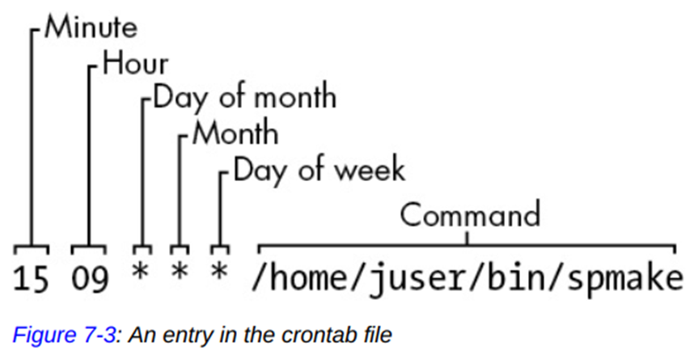
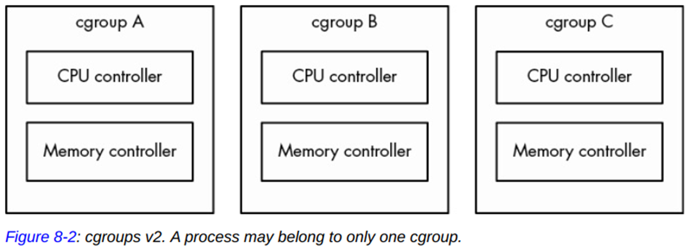
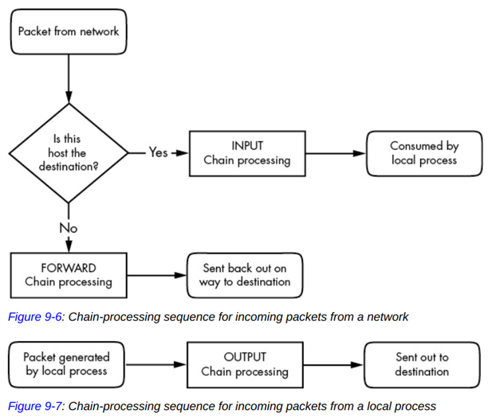

# 1 THE BIG PICTURE

Main memory/user space  
Kernel  
Processes  
Users

# 2 BASIC COMMANDS AND DIRECTORY HIERARCHY

## 2.2 Using the Shell

### 2.2.1 The Shell Window

- The best practice when running **superuser commands (\#)** is to use **sudo** to provide some protection and a **log** that you can look up later for possible errors.

### 2.2.3 Standard Input and Standard Output

- Unix processes use **I/O streams** to read and write data.
- 3 types of I/O streams: **stdin, stdout, stderr**
- **CTRL-D** on an empty line stops the current standard input entry with an EOF message (and often terminates a program)
- **CTRL-C** usually terminates a program regardless of its input and output.

## 2.3 Basic Commands

```bash
$ ls -l

$ cp file1 file2
$ cp file dir
$ cp file1 file2 file3 dir

$ mv file1 file2

# If the target file already exists, touch doesn't change it but updates its modification timestamp.
$ touch file
$ ls -l file

$ rm file

# useful for finding expansions of shell globs ("wildcards" such as *) and variables (such as $HOME)
$ echo Hello again.
```

## 2.4 Directory Commands

```bash
$ cd dir

$ mkdir dir

$ rmdir dir
$ rmdir -r dir

# Shell Globbing ("Wildcards") examples
# Globbing is the process of matching patterns to file and directory names
$ echo *
$ ls b?at

# Uses single quotes ('') to treat glob as literal.
$ echo '*'
```

## 2.5 Intermediate Commands

```bash
$ grep root /etc/passwd
$ grep root /etc/*
# To show the filename for each match
$ grep -H root /etc/*
# case-insensitive matches
$ grep -i rOoT /etc/passwd
# Inverts the search
$ grep -v root /etc/passwd

# Press the spacebar to go forward and b to go backward
# Type /<word> to search forward and ?<word> to search backward
$ less /usr/share/dict/words
$ grep ie /usr/share/dict/words | less

# Print true full path of the current working directory of a symbolic link
$ pwd -P

# Check file format
$ file example.sh

$ find /usr/bin -name ls -print

# Print the first 5 lines of the file.
$ head -5 /etc/passwd
# Print lines of the file, starting at line 6.
$ tail +6 /etc/passwd

# Use -n to sort in numerical order
# Use -r to sort in reverse.
$ sort /etc/passwd
```

## 2.7 Dot Files

- The configuration files are called dot files.
- Common dot files are **.bashrc** and **.login**
- Use a pattern such as `.[^.]*` or `.??*` to get all dot files **except the current and parent directories**.

## 2.8 Environment and Shell Variables

```bash
# Don't put any spaces around the = when assigning a variable.
$ STUFF=blah
$ echo $STUFF

# Make the shell variable into an environment variable.
$ export STUFF
```

- Linux passes all of your shell's environment variables to programs that the shell runs.
- Many programs use environment variables for configuration and options.

## 2.9 The Command Path

```bash
$ echo $PATH

# Note: Changes are temporary
# add a directory to the beginning of the path
$ PATH=dir:$PATH
# append a directory to the end of the path
$ PATH=$PATH:dir
```

## 2.11 Command-Line Editing

| Keystroke | Action                                            |
| :-------- | :------------------------------------------------ |
| CTRL-B    | Move the cursor left                              |
| CTRL-F    | Move the cursor right                             |
| CTRL-P    | View the previous command (or move the cursor up) |
| CTRL-N    | View the next command (or move the cursor down)   |
| CTRL-A    | Move the cursor to the beginning of the line      |
| CTRL-E    | Move the cursor to the end of the line            |
| CTRL-W    | Erase the preceding word                          |
| CTRL-U    | Erase from cursor to beginning of line            |
| CTRL-K    | Erase from cursor to end of line                  |
| CTRL-Y    | Paste erased text (for example, from CTRL-U)      |

## 2.13 Getting Help

```bash
# Search for manual pages by keyword
$ man -k sort
# Selects a manual page by section
$ man 5 passwd
```

- Some packages dump their available documentation into **/usr/share/doc**

## 2.14 Shell Input and Output

### 2.14.1 Standard Error

```bash
# Send standard output to f (>) and standard error to e (2>)
# 2 is standard error's stream ID
$ ls /fffffffff > f 2> e
# Send the standard error to the same place as stdout with the >& notation
$ ls /fffffffff > f 2>&1
```

## 2.16 Listing and Manipulating Processes

**TIME** field in ps command \- The total amount of time that the process has spent running instructions on the processor (this is different from the time since the process started).

### 2.16.1 ps Command Options

```bash
# BSD style
# Show all of your running processes.
$ ps x [PID]...
# Show all processes on the system, not just the ones you own.
$ ps ax
# Include more detailed information on processes.
$ ps u
# Show full command names, not just what fits on one line.
$ ps w

# $$ is a shell variable that evaluates to the current shell's PID.
$ ps u $$
```

### 2.16.2 Process Termination

```bash
# There are many types of signals.
# The default is TERM (terminate)
$ kill <pid>

# To freeze a process instead of terminating it.
$ kill -STOP <pid>
# To continue running the process again.
$ kill -CONT <pid>

# The most brutal way to terminate a process.
$ kill (-KILL|-9) <pid>

# To get a mapping of signal numbers to names.
$ kill -l
```

- CTRL-C acts the same as using kill to end the process with the INT (interrupt) signal.

### 2.16.3 Job Control

- To run multiple programs, run each in a separate terminal, put non-interactive processes in the background, and learn to use the **screen** and **tmux** utilities.

### 2.16.4 Background Processes

```bash
# Use & to detach a process from the shell and put it in the background.
# It can even continue to run after you log out.
$ gunzip file.gz &
```

- Use the `nohup` command to keep a program running when logging out from a remote machine.
- If a program tries to read something from the **standard input** when it's in the **background**, it can **freeze** (try the `fg` to bring it back) or **terminate**.
- To make sure that a background process doesn't bother you is to redirect its output (and possibly input)

## 2.17 File Modes and Permissions

- Use the `groups` command to see what group you're in.
- Some executable files have an **s** in the user permissions, which indicates it is **setuid**. It **runs as** though the **file owner** is the user instead of you (to get the file owner's privileges). For example, the `passwd` program.
- Common **absolute** permission modes:
  
- You can only access a file in a directory if the **directory** is **executable**.
- Use the `umask` command to set default permissions to any new file or directory.
- Use `umask 022` (default) if you want everyone to be able to see all of the files and directories that you create, and use `umask 077` if you don't.

### 2.17.2 Working with Symbolic Links

```bash
# /home/origdir is the target, and somedir is the link name.
# /home/origdir doesn't need to exist to create the symbolic link.
$ ln -s /home/origdir somedir
```

- A symbolic link is a file that points to another file or a directory.
- Offers quick access to obscure directory paths.
- Symbolic links are simply filenames that point to other names.
- **Caveats:**
  - The file type of the link target can't be easily identified just by looking at the symbolic link.
  - Chained symbolic link \- link that points to another link.
  - Without the \-s option, ln creates a hard link, which can be more confusing than symbolic links. So, avoid using them.

## *2.18 Archiving and Compressing Files

```bash
$ gzip file
$ gunzip file.gz

# c flag activates create mode.
# v flag activates verbose diagnostic output.
# f flag denotes the file option.
$ tar cvf archive.tar file1 file2
# Use x flag to unpack a .tar file.
# Use p flag to preserve permissions from being overridden by umask.
# p flag is the default when you're working as the superuser.
$ tar xvpf archive.tar
# Use t flag to check the contents.
$ tar tf archive.tar

$ gunzip file.tar.gz
$ tar xvf file.tar

# zcat is the same as gunzip -dc. -d: decompresses. -c: sends the result to standard output.
$ zcat file.tar.gz | tar xvf -
# Use z option (zcat shortcut) to invoke gzip on the archive automatically.
# You're actually performing two steps when taking the shortcut.
$ tar ztvf file.tar.gz
```

- **.tgz** file is the same as **.tar.gz** file. It is meant to fit into FAT (MS-DOS-based) filesystems.

## 2.19 Linux Directory Hierarchy Essentials


### 2.19.0 Important Root Subdirectories

Subdirectory | Description
-------------|------------
/bin | Contains **executables**. Some are in binary format, some are shell scripts.
/dev | Contains **device** files.
/etc | Core **system configuration** directory.
/home | Holds home (personal) directories for **regular users**.
/lib | Holds library files containing code that executables can use. It should contain only **shared libraries**.
/proc | Provides **system statistics** through a brows-able directory-and-file interface. It contains **process information**.
/run | Contains **runtime data** specific to the system, including certain process IDs, socket files, status records, and, in many cases, system logging. A temporary filesystem (**tmpfs**) mounted at boot time.
/sys | Similar to /proc in that it provides a **device and system interface**.
/sbin | Contains **executables related to system management**. Regular users usually don't have /sbin components in their command path.
/tmp | A storage area for **smaller**, temporary files that you don't care much about.
/usr | Has no user files. Many of the directories in /usr are the same as those in the root directory. (In the past, it was to keep space requirements low for the root.)
/var | Programs record information that can **change over time**. System logging, caches, and other files that system programs create and manage are here.

### 2.19.1 Other Root Subdirectories

Subdirectory | Description
-------------|------------
/boot | Contains **kernel boot loader files** that pertain only to the **very first stage** of the Linux startup procedure. You won't find information about how Linux starts up its services.
/media | Base attachment point for removable media such as flash drives.
/opt | May contain additional third-party software.

### 2.19.2 The /usr Directory

- /usr is where most of the user-space programs and data reside.

Subdirectory | Description
-------------|------------
/include | Holds **header files** used by the C compiler.
/local | It's where administrators can install their own software. **Its structure should look like that of  / and /usr**.
/man | Contains manual pages.
/share | Contains files that should work on other kinds of Unix machines with no loss of functionality. These are usually **auxiliary data files** that programs and libraries read as necessary.

# 3 DEVICES

- **Device files** \- **Traditional system** to work with devices. Kernel provides **device configuration information** through **sysfs**. sysfs is a **special-purpose filesystem**, which is **mounted on /sys**.
- **udev system** enables user-space programs to automatically configure and use new devices.
- Kernel presents many of the **device I/O interfaces** to user processes **as files**.

## 3.1 Device Files

```bash
# When data is written to a device, the kernel uses its device driver to process it.
echo blah blah > /dev/null
```


- For block and character devices, the **numbers** before the dates are the **major** and **minor** device numbers that the kernel **uses to identify the device**.
- Not all devices have device files.

Device Type | Description
------------|------------
Block device | Processes have **quick random access** to any block in the device. E.g. Disk device
Character device | Works with **data streams**. During character device interaction, the kernel cannot back up and reexamine the data stream after it has passed data to a device or process.
E.g. Printer
Pipe device | Named pipes are like character devices, with another process at the other end of the I/O stream.
Socket device | Frequently used for inter-process communication.

## 3.2 The sysfs Device Path

- Kernel assigns devices in the order in which they are found, so a device may have a different name between reboots.
- To provide a **uniform view for attached devices**, the kernel offers the **sysfs interface** (**/sys/devices**) through a system of files and directories.
- The **/dev** file enables user processes **to use the device**, whereas the **/sys/devices** path is used **to view information and manage the device**.
- There are **shortcuts in the /sys** directory such as **/sys/block**.

```bash
# To find the sysfs location of a device use the udevadm command.
$ udevadm info --query all --name /dev/sda
```

## 3.3 dd and Devices

- dd (**data duplicator**) is extremely useful when working with **block and character devices**.
- dd can do encoding conversion when copying an input file/stream.
- dd can process a chunk of data in the middle of a file with the **skip option**.

```bash
# Copies a single 1,024-byte block from /dev/zero to new_file.
# if - input file
# of - output file
# bs - block size
# count - number of blocks to copy
$ dd if=/dev/zero of=new_file bs=1024 count=1
```

## 3.4 Device Name Summary

Ways to find the device name:

- **Query udevd using udevadm** (the only reliable method)
- Explore `/sys` directory
- Check the output of the `journalctl -k` command
- Check the output of the `mount` command (for disk devices that are already visible to the system)
- Run `cat /proc/devices` to see the block and character devices for which your system has drivers.

### 3.4.1 Hard Disks: /dev/sd\*

- /dev/sda, /dev/sdb represent entire disks.
- /dev/sda**1**, /dev/sda**2** represent **partitions**.
- sd stands for SCSI disk.
- SCSI protocol is a standard for communication between devices such as disks.

```bash
# To list the SCSI devices.
$ lsscsi
```

### 3.4.4 Device Mapper: /dev/dm-\*, /dev/mapper/\*

- A level up from disks is the Logical Volume Manager (LVM).

### 3.4.6 PATA Hard Disks: /dev/hd\*

- PATA (aka **IDE**) is an older type of storage bus.
- If a SATA drive is recognized as a PATA hard disk, then it is running in a compatibility mode, which hinders performance.

### 3.4.7 Terminals: /dev/tty\*, /dev/pts/\*, and /dev/tty

- Terminals are devices for moving characters between a user process and an I/O device.
- A process does not need to be attached to a terminal.
- Linux supports virtual consoles to multiplex the display.

### 3.4.11 Device File Creation

- Device files are created by **devtmpfs** and **udev**.

## 3.5 udev

- Linux kernel can **send notifications to** a user-space process called **udevd** upon detecting a new device (e.g. USB flash drive) on the system.

### 3.5.1 devtmpfs

- It was developed in response to the problem of device availability during boot.
- **Kernel creates device files** as necessary, **it notifies udevd that a new device is available**. Upon receiving this signal, **udevd** does not create device files, but it does **perform device initialization** along with **setting permissions** and **notifying other processes that new devices are available**. It also **creates symbolic links in /dev/disk/by-id to further identify devices**.

## Skipped remaining material in this chapter…

# 4 DISKS AND FILESYSTEMS


- You can work with the disk through the filesystem as well as directly through the disk devices.

## 4.1 Partitioning Disk Devices

- There are many kinds of **partition tables** such as Master Boot Record (**MBR**) and Globally Unique Identifier Partition Table (**GPT**).
- Linux partitioning tools: parted, gparted, fdisk

### 4.1.1 Viewing a Partition Table

```bash
# View your system's partition table.
# The parted output shows an approximated size.
$ sudo parted -l
# fdisk output shows an exact number, but the units are 512-byte "sectors"
$ sudo fdisk -l
```

- Basic **MBR has a limit of four primary partitions**, for more, you must designate one as an extended partition. An extended partition breaks down into logical partitions.

### 4.1.2 Modifying Partition Tables

- Before modifying the partition table, ensure that no partitions on your target disk are currently in use.
- After modifying the partition table, **fdisk** issues a system call to tell the kernel to reread the disk's partition table.
  1. Use **journalctl \-k** to view the debugging output of rereading the partition table.
- For **parted**, it signals the kernel when individual partitions are altered.
  1. Use udevadm to watch the kernel event changes: udevadm monitor \--kernel
  2. Check /proc/partitions

```bash
# forcing a partition table reload (same as the old-style system call that fdisk issues)
$ sudo blockdev --rereadpt /dev/sdc
```

### \*4.1.3 Creating a Partition Table

```bash
# p command to print the current partition table.
# d command to delete a partition.
# q command to quit and discard changes.
# w command to write and commit the changes. 
$ sudo fdisk /dev/sdc
```

## 4.2 Filesystems

- **Virtual File System (VFS)** ensures that all filesystem implementations support a standard interface so that user-space applications access files and directories in the same manner.

### 4.2.1 Filesystem Types

- Extended filesystem (ext) series support backward compatibility.

Filesystem Type | Description
----------------|------------
Fourth Extended filesystem (**ext4**) | **Current iteration** of the Extended filesystem series native to Linux. It is an incremental improvement over previous iterations.
Third Extended filesystem (ext3) | Added a **journal feature** (a **cache** outside the normal filesystem data structure) to enhance data integrity and hasten booting.
Second Extended filesystem (ext2) | Was a longtime default for Linux systems
B-tree filesystem (btrfs) | A newer filesystem native to Linux designed **to scale beyond the capabilities of ext4**.
FAT filesystems (msdos, **vfat**, **exfat**)<br>New Technology File System (NTFS) | Belong to **Microsoft** systems.
XFS | A high-performance filesystem
HFS+ (hfsplus) | Used on most Macintosh systems.
ISO 9660 (iso9660) | A CD-ROM standard.


### \*4.2.2 Creating a Filesystem

```bash
# Superblock is a key component at the top level of the filesystem database
$ sudo mkfs -t ext4 /dev/sdb2

# mkfs is a frontend for a series of filesystem creation programs.
$ ls -l /sbin/mkfs.*
```

### \*4.2.3 Mounting a Filesystem

```bash
# To learn the current filesystem status of your system.
$ mount
# -t option is usually optional for Linux native filesystems.
$ sudo mount -t ext4 /dev/sdb2 /home/user6/extra
# /mnt is a temporary mount point typically used for testing.
$ sudo mount /dev/sdb2 /mnt
# Can also unmount with its device (/dev/sdb2).
$ sudo umount /home/user6/extra
```

### 4.2.4 Filesystem UUID

```bash
# To view a list of devices and the corresponding filesystems and UUIDs.
# Linux native partitions all have UUIDs, but the FAT partition doesn't.
$ sudo blkid

$ sudo mount UUID=d2ace216-89c2-4b7f-b2a5-6df4b2b32522 /home/user6/extra

# change the UUID of a filesystem
$ sudo tune2fs -U 641b1a3a-ddd7-4cd4-9702-038513891fd1 /dev/sdb2
```

### 4.2.5 Disk Buffering, Caching, and Filesystems

- Kernel usually doesn't immediately write changes to filesystems. Instead, it **stores those changes in RAM (disk buffers)** until the kernel determines a good time to write them to the disk.
- When you **unmount** a filesystem, the kernel automatically **synchronizes with the disk**.

```bash
# Force the kernel to synchronize cached writes to persistent storage.
$ sync
```

### 4.2.6 Filesystem Mount Options

```bash
# Use -o option to specify filesystem options
$ sudo mount -o remount,rw /dev/sdb2 /home/user6/extra
```

Option | Description
-------|------------
**Short General Options**
-r | Mounts in read-only mode.
-n | Ensures no changes to the system runtime mount database, /etc/mtab. Mount operation fails when it cannot write to this file. This option is important at boot time because the root partition is read-only at first. 
-t | Specifies the filesystem type.
**Long Options (-o)**<br>Many general options and all **filesystem-specific options** use long option format.
exec, noexec | Enables or disables execution of programs.
suid, nosuid | Enables or disables setuid programs.
ro | Mounts in read-only mode. (same as -r)
rw | Mounts in read-write mode.
remount | Remounts a filesystem with new options.

### 4.2.8 The /etc/fstab Filesystem Table

- **dump** field is **long-obsolete**, so always set it 0\.
- **pass** field is for the filesystem integrity test order. Set it to **1 for the root filesystem**, **2 for any other locally attached filesystems** on a hard disk or SSD, and use **0 to disable the bootup check for every other filesystem**.
- Use **mount \-a** to simultaneously mount all entries in /etc/fstab that do not contain the noauto option.
- **/etc/fstab** file is the **traditional way** to represent filesystems and their mount points.

/etc/fstab Option | Description
------------------|------------
defaults | The defaults are read-write mode, enable device files, executables and setuid bit.
errors | ext2/3/4-specific option.<br>**errors=continue** - the kernel returns an error code and keeps running.<br>**errors=remount-ro** - try the mount again in read-only mode.<br>**errors=panic** - halt the system on error.
noauto | To prevent a boot-time mount of a removable-media device.

### 4.2.9 Alternatives to /etc/fstab

- **/etc/fstab.d** directory, which contain individual filesystem configuration files.
- Configures **systemd units** for the filesystems.

### 4.2.10 Filesystem Capacity

```bash
# To view the size and utilization of mounted filesystems.
# Filesystems usually have hidden reserved blocks that only the superuser can use. This is 
#   to keep servers from immediately failing when they run out of disk space.
$ df

# To get a usage listing.
$ du
```

### 4.2.11 Checking and Repairing Filesystems

```bash
# To check a filesystem.
# Never use fsck on a mounted filesystem, except you mount the root partition read-only 
#   in single-user mode.
$ sudo fsck /dev/sdb2
# To check the filesystem without modifying anything.
$ sudo fsck -n /dev/sdb2

# To restore the corrupted superblock with a backup.
$ sudo fsck -b <num> /dev/sdb2
# To view a list of superblock backup numbers without destroying the data.
$ sudo mkfs -n /dev/sdb2

# To flush the journal in an ext3 or ext4 filesystem to the regular filesystem database.
$ sudo e2fsck -fy /dev/sdb2
```

- Ways to recover from a failing disk (The worst case)
  1. Extract the entire filesystem image from the disk with **dd** and transfer it to a partition on another disk of the same size.
  2. Use **debugfs** \- a tool allows you to look through the files on a filesystem and copy them elsewhere.

### 4.2.12 Special-Purpose Filesystems

Special-purpose Filesystem | Description
---------------------------|------------
proc (/proc) | Provides kernel and hardware information in files like /proc/cpuinfo.
sysfs (/sys) | To provide a **uniform view for attached devices**.
tmpfs (/run) | Use physical memory and swap space as temporary storage.

## 4.3 Swap Space

- Disk area used to store memory pages.

```bash
# Shows the current swap usage in kilobytes
$ free
```

### 4.3.1 Using a Disk Partition as Swap Space

```bash
# Puts a swap signature on the partition
$ sudo mkswap /dev/sdb1
# To register the space
$ sudo swapon /dev/sdb1
# To unregister the space
$ sudo swapoff /dev/sdb1

# In /etc/fstab
/dev/sdb1 none swap sw 0 0
```

### 4.3.2 Using a File as Swap Space

```bash
$ sudo dd if=/dev/zero of=swap_file bs=1024k count=8
$ sudo mkswap swap_file
$ sudo swapon swap_file
```

## \*4.4 The Logical Volume Manager

- **Disadvantages** of disk direct management (e.g. fdisk)
  1. Disk upgrade process can be error-prone and requires several reboots.
  2. Data must be **distributed manually** between the old and new disks because each disk partition has its own mount point.

### 4.4.2 Working with LVM

- **Logical volume** block devices (e.g. /dev/dm-0) may be arranged in any order. Due to this, LVM creates **symbolic links** to the devices (**e.g. /dev/myvg/mylv1, /dev/mapper/myvg-mylv1**). Many systems use these links in /etc/fstab, systemd, and boot loader configurations.

```bash
# To list volume groups.
$ sudo vgs
# Shows the volume group's properties.
$ sudo vgdisplay

$ sudo lvs
# LV path is the device path of the logical volume (e.g. /dev/myvg/mylv1)
$ sudo lvdisplay

$ sudo pvs
$ sudo pvdisplay

# =========================================================================

# 1. Create a single partition on each of the disks and label it for LVM using fdisk 
# (Partitioning enables booting from the disk)

# 2. Creating Physical Volumes and a Volume Group
# Designates one of the partitions as a PV and assigns it to a new volume group.
$ sudo vgcreate myvg /dev/sdb1
# Use vgs to verify the result.
$ sudo vgs
# If the system doesn't detect changes to LVM, issue pvscan.
$ sudo pvscan
# To add more PV
$ sudo vgextend myvg /dev/sdc1

# 3. Creating Logical Volumes
# --type linear is optional because it's the default
$ sudo lvcreate --size 3g --type linear -n mylv1 myvg
$ sudo lvcreate --size 3g --type linear -n mylv2 myvg

# 4. Manipulating Logical Volumes: Creating Partitions
$ sudo mkfs -t ext4 /dev/mapper/myvg-mylv1
# Mount the filesystem manually for testing
$ sudo mount /dev/mapper/myvg-mylv1 /mnt
# Check the filesystem disk space usage
$ df /mnt

# 5. Removing Logical Volumes
# lvremove uses a different syntax for specifying the logical volume.
$ sudo lvremove myvg/mylv2

# Resizing Logical Volumes and Filesystems
# Shrinking can't be done without first unmounting the filesystem.
$ sudo lvresize -r -l +255 myvg/mylv1
```

### 4.4.3 The LVM Implementation

- LVM is just the name of a suite of user-space utilities.
- **Kernel handles the work of routing** a request for a location on a logical volume's block device to the true location on an actual device.
- **Device mapper (kernel driver)** is sandwiched between normal block devices and the filesystem.
- There's a **header** at the beginning of every **PV** that identifies the volume as well as its volume groups and the logical volumes within.

  ```bash
  # Shows the LVM header on a PV
  $ sudo dd if=/dev/sdb1 count=1000 | strings | less
  ```

- Device mapper is responsible to initialize the block devices for the logical volumes and load their mapping tables.

  ```bash
  # Shows some brief information about the mapped devices.
  $ sudo dmsetup info
  # Views the mapping table
  $ sudo dmsetup table
  ```

## Skipped remaining material in this chapter…

# 5 HOW THE LINUX KERNEL BOOTS

- **init** is the first user space program that the kernel starts, and it has the process id of 1\.
- **systemd** is the most widespread version of init.

## 5.1 Startup Messages

```bash
# To view the current kernel's boot and runtime diagnostic messages captured by systemd.
$ journalctl -k
# To view the messages in the kernel log file.
$ less /var/log/kern.log
# To view the messages in the kernel ring buffer (aka kernel log)
$ dmesg -H
```

## 5.2 Kernel Initialization and Boot Options

- Kernel initializes in this general order:
  1. CPU inspection
  2. Memory inspection
  3. Device bus discovery
  4. Device discovery
  5. Auxiliary **kernel subsystem** setup (**networking** and the like)
  6. Root filesystem mount
  7. User space start

## 5.3 Kernel Parameters

```bash
# To view the current kernel parameters.
# Kernel passes any parameters that it doesn't understand to init.
$ cat /proc/cmdline
```

## 5.4 Boot Loaders

- Boot loaders access the disk and locate the kernel image **through the interfaces of BIOS/UEFI**.
- Contemporary disk hardware includes firmware allowing the BIOS/UEFI to access storage hardware via Logical Block Addressing (LBA).

```bash
# To determine if your system uses a BIOS or UEFI
$ efibootmgr
```

## 5.5 GRUB Introduction

- GRUB has many Linux-like commands, but they are built **completely differently**.

### 5.5.1 Exploring Devices and Partitions with the GRUB Command Line

```bash
# To list devices
# GRUB has its own device-addressing scheme. E.g. The first storage device found is named hd0.
grub> ls
# To get more detailed information about the devices.
grub> ls -l

# $root is where GRUB expects to find the kernel.
grub> echo $root
# To list the files and directories of the specified device.
grub> ls ($root)/

# To view all GRUB variables.
grub> set
```

### 5.5.2 GRUB Configuration

- Many distributions use the submenu command for older versions of the kernel.
- Every file in `/etc/grub.d` is a shell script that produces a piece of the grub.cfg file.
- 2 options to customize the grub configuration:
  1. **`/etc/grub.d/40_custom`** \- add your custom commands in 40_custom. Then, **build a new configuration file using grub-mkconfig**. This will embed the custom commands in the grub.cfg.
  2. **`/etc/grub.d/41_custom` (preferred)** \- put the customizations into a new **`/boot/grub/custom.cfg`** file, and grub.cfg will then load it.

## Skip the remaining material in this chapter…

# 6 HOW USER SPACE STARTS

- User space starts in roughly this order:
  1. init (**`systemd`**)
  2. Essential low-level services, such as **`udevd`** and **`syslog`** (systemd Auxiliary Components)
  3. **Network** configuration
  4. Mid- and high-level services (**cron**, printing, and so on)
  5. Login prompts, GUIs, and high-level applications, such as **web servers**

## 6.1 Introduction to init

- The main purpose is **to start and stop the essential service processes**.
- **systemd** is the standard implementation of init.
- Two other varieties of init on older systems are System V and Upstart (Ubuntu).
- System V (traditional init) limitations
  - It runs a series of scripts in sequence, one at a time.
  - No standard way to track running services.
  - Startup scripts tend to include a lot of “boilerplate” code.
  - Little notion of on-demand services and configuration.

## 6.3 systemd

- Can track service daemons, and group together multiple processes associated with a service (cgroup).

### 6.3.1 Units and Unit Types

These are the most significant unit types **that perform the boot-time tasks**.

Unit Type | Description
----------|------------
Service units | Control the service daemons.
Target units | Control **other units**, usually by **grouping** them.
Socket units | Represent **incoming** network connection request locations. E.g. **port**
Mount units | Represent the attachment of filesystems.

### 6.3.3 systemd Configuration

- Two main directories:
  1. **System unit** directory - `/lib/systemd/system` or `/usr/lib/systemd/system`
  2. **System configuration** directory - `/etc/systemd/system`
- **Avoid making changes to the system unit directory**, and make your changes to the system configuration directory.

  ```bash
  # To check the systemd configuration search path
  $ systemctl -p UnitPath show

  # View the unit dependencies, e.g. Wants, Requires
  $ sudo systemctl -p Wants show systemd-journald.service
  ```

- In a unit file, there can be **multiple sections denoted by square brackets**, each containing multiple options.
- In a **service unit**, you'll find the details in the **`[Service]` section**, including how to **prepare**, **start**, and **reload** the service.
- Upon unit activation, systemd records and stores its PID in the **`$MAINPID`** variable.
- Specifier (**%**) is a **variable-like feature**.
  - It can be used in units that support **multiple instances**.
  - Add an **`@`** symbol to the end of the unit name to enable unit instantiation. E.g. `getty@.service`
  - systemd replaces the `%I` or `%i` specifier with the instance.

### *6.3.4 systemd Operation

```bash
# To view a list of active units
# Use --full option to view the full names of the units.
# Use --all option to see all units (not just those that are active).
$ systemctl list-units

$ systemctl status sshd.service

# Show control group contents
$ systemd-cgls

# View all of a unit's messages
$ journalctl --unit ssh.service

$ sudo systemctl start test1.target
$ sudo systemctl stop test1.target
$ sudo systemctl restart test1.target
# Reload the unit configuration.
$ sudo systemctl reload test1.target
# Reload ALL unit configurations
$ sudo systemctl daemon-reload

# If a unit has an [Install] section, it must be enabled before activation.
$ sudo systemctl enable test1.target
# If a unit has an [Install] section, disable the unit to remove generated symbolic links.
$ sudo systemctl disable test1.target

$ sudo systemctl -p Wants show systemd-journald.service
```

### 6.3.5 systemd Process Tracking and Synchronization

- To manage activated units, systemd uses **cgroups** **for finer tracking of a process hierarchy**.

**Service unit files** use the **`[Service]`** section's **Type option** to indicate **startup behavior/status**.
Type option | Description
------------|------------
Type=**simple** | The service doesn't fork and terminate. It remains the main service process. <br><br>Unable to determine whether the service process is ready.
Type=**forking** | The service forks, and systemd expects the original service to terminate. Upon this termination, systemd assumes the service is ready.
Type=**notify** | The service makes a systemd-specific function call to signal its readiness.
Type=**dbus** | The service registers itself on the D-Bus to signal its readiness.
Type=**oneshot** | The service terminates completely with no child processes after starting. <br><br>It's like **Type=simple**, except that systemd does not consider the service to be started until the service terminates. <br><br>systemd regards a service as active even after its termination.
Type=**idle** | Works like **Type=simple**, but it instructs systemd not to start the service until all active jobs finish (**delay start**).

### 6.3.6 systemd Dependencies

Dependency type<br>(Specify under `[Unit]` section) | Description
----------------------------------------------------|------------
**Basic**
Requires | systemd attempts to activate the dependency unit. If the dependency unit fails, systemd also deactivates the dependent unit.
Wants | systemd doesn't care if dependencies fail.
Requisite | Dependency units must be active before activating the dependent unit.
Conflict | systemd deactivates the opposing dependency if it's active.
**Ordering**
Before | Activates before the listed unit(s).
After | Activates after the listed unit(s).
**Conditional**<br>(systemd activates unit dependencies regardless of whether the condition is true or false)
ConditionPathExists=p | True if the path p exists.
ConditionPathIsDirectory=p | True if p is a directory.
ConditionFileNotEmpty=p | True if p is a file and it's not zero-length.

- To specify the dependent unit in a dependency's unit file, you can add a `WantedBy` or `RequiredBy` parameter in the **`[Install]` section** (e.g. when you'd rather not edit a system unit file).
- .wants and .requires directories are created after enabling the unit to establish the dependencies.
- Manually adding .wants and .requires directories is a simple way to add a dependency without modifying a unit file, but it can be difficult to trace.

### 6.3.7 systemd On-Demand and Resource-Parallelized Startup

- Typical on-demand unit startup setup:
  1. Create a unit, Unit A, for the service.
  2. Identify a resource (e.g. network port/socket, file, device) that Unit A uses to offer its services.
  3. Create another unit, Unit R, to represent that resource.
  4. Define the relationship between Unit A and Unit R, this can be implicit (based on the units' names) or explicit.
- Operation after setup:
  1. Upon activation of Unit R, systemd monitors the resource.
  2. If the service, Unit A, isn't ready, any requests to the resource will be buffered.
  3. systemd activates Unit A.
  4. Unit A takes control of the resource and reads the buffered input.
- Example
  1. Create a socket unit (resource), named **echo.socket**, to represent the port.
  2. Create a service unit, named **`echo@.service`** (link the resource implicitly by naming convention). systemd knows to activate the service unit when there's activity on the socket unit.

```bash
# echo.socket file
[Unit]
Description=echo socket

[Socket]
ListenStream=22222
# Instructs systemd not only listen on port, but also to accept incoming connections on behalf of 
#   the service unit and pass it to them, creating a separate instance for each connection.
Accept=true

# =========================================================================

# echo@.service file
[Unit]
Description=echo service

[Service]
ExecStart=/bin/cat
StandardInput=socket
# Link the resource explicitly
Socket=echo.socket

# =========================================================================

$ sudo systemctl start echo.socket

# systemd activates the echo@.service upon receiving input from the socket.
$ telnet localhost 22222
```

### 6.3.8 systemd Auxiliary Components

- systemd includes support for tasks not related to startup and service management, such as **`udevd`**, **`journald`** and **`resolved`**. These services are prefixed with **`systemd-`**.

## 6.4 System V Runlevels

- Runlevels (0 \- 6\) represent **the state of the machine,** such as system startup, shutdown, single-user mode and console mode.
- Runlevels (2 \- 4\) for the text console, and runlevel 5 for the GUI login.
- Runlevels are **obsolete**. systemd supports it merely for System V compatibility.

## 6.5 System V init

- Supports an **orderly** boot-up to different runlevels.
- It is now uncommon.
- It has 2 components:
  1. Central configuration file - `/etc/inittab`
  2. A set of boot scripts - `/etc/rc*.d`, rc stands for run commands (aka scripts, programs, or services)

### 6.5.2 The System V init Link Farm

- `rc*.d` directories contains **symbolic links** (aka link farm) to files in `/etc/init.d`
- To prevent a command from running, rename its symbolic link (e.g. add an underscore at the beginning of the link name).

### *6.5.3 run-parts

- A program inspired by the System V mechanism.
- It **runs a collection of executables in a directory**, in some kind of predictable order.

### 6.5.4 System V init Control

- When switching runlevels, init kills off any processes not in the inittab file.

## 6.6 Shutting Down Your System

```bash
# Halt immediately
$ sudo shutdown -h now
# Reboot in 10 mins
$ sudo shutdown -r +10
```

- If you specify a time other than now, the shutdown command creates a file called `/etc/nologin`.
- On **systemd**, it means activating the **shutdown units**.
- On **System V init**, it means **changing the runlevel** to 0 (halt) or 6 (reboot).

## 6.7 The Initial RAM Filesystem

- **Problem**
  - Since the kernel doesn't talk to the BIOS/UEFI interfaces, it needs driver support in order to mount the root filesystem and hand off to init.
  - There are so many storage drivers that distributions can't include in their kernels, and many drivers are shipped as loadable modules.
- **Solution**
  - Gather necessary kernel driver modules and utilities into an **archive**.
  - **Boot loader loads the archive into memory** before running the kernel.
  - Kernel reads archive contents into a temporary RAM filesystem (**initramfs**), mounts initramfs at / and hands off to the init on initramfs.
  - Utilities included in initramfs to load necessary driver modules for the real root filesystem, mount the real root filesystem and start the true init.

## 6.8 Emergency Booting and Single-User Mode

- Single-user mode doesn't offer many functions.
- **Live images** are **always preferable**.

# 7 SYSTEM CONFIGURATION: LOGGING, SYSTEM TIME, BATCH JOBS, AND USERS

## 7.1 System Logging

- `syslogd` performs system logging by sending messages to an appropriate channel (e.g. file, database).
- A log message typically contains the **process name**, **process ID**, and **timestamp**. There can also be two other fields: the **facility** (a general category) and **severity**.

### 7.1.1 Checking Your Log Setup

- To see what sort of logging is installed:
  - Run **`journalctl`**
  - Look for **`rsyslogd`** in the process listing or look for **`/etc/rsyslog.conf`**
  - Look for `/etc/syslog-ng`
- **`/var/log`** is the directory for log files.
- syslogd creates most of the files in `/var/log`, but some are maintained by other services (e.g. wtmp, lastlog).
- **Subdirectories in `/var/log`** nearly always come from other services, such as **`/var/log/journal`** is where **`journald`** stores its log files.

### *7.1.2 Searching and Monitoring Logs

```bash
# Use -r option to reverse the message time order.
$ journalctl -r

# Filtering by Time
# =================
# -S (Since); -4h (past 4 hours)
$ journalctl -S -4h
# More examples
$ journalctl -S 06:00:00
$ journalctl -S 2020-01-14
$ journalctl -S '2020-01-14 14:30:00'

# Filtering by Unit
# =================
# An effective way to get relevant logs.
$ journalctl -u cron.service
# List all units.
$ journalctl -F _SYSTEMD_UNIT

# Finding Fields
# ==============
# List all available fields. 
# Any field beginning with an underscore is a trusted field, which means the client that sends 
#   a message cannot alter these fields.
$ journalctl -N
# Search individual fields (e.g. _PID, _BOOT_ID)
$ journalctl _PID=8792

# Filtering by Text
# =================
# Run grep (-g) over messages.
# You get only the messages that match the expression. Often, important information might be nearby. 
#   So, run journalctl -S to see what messages came around the same time.
$ journalctl -g 'kernel.*memory'

# Filtering by Boot
# =================
# Show messages from the start of the current boot
$ journalctl -b
# Show messages from the previous boot (-1)
$ journalctl -b -1
# Check whether the machine shut down cleanly on the last cycle.
$ journalctl -r -b -1
# List boot IDs
$ journalctl --list-boots

# Filtering by Severity/Priority
# ==============================
# 0 (most important) and 7 (least important)
# This might not be as useful as you think since most applications don't generate many logs by default.
# Get the logs from levels 0 through 3.
$ journalctl -p 3
# Get the logs from levels 2 through 3.
$ journalctl -p 2..3

# Simple Log Monitoring
# =====================
# Use -f (follow mode) to see messages as they arrive.
# Can be used in conjunction with the preceding filtering options.
$ journalctl -f
```

### 7.1.3 Log File Rotation

- Most distributions use **logrotate** utility to delete old log files managed by syslog daemon.

### 7.1.4 Journal Maintenance

- journald deletes messages based on
  - **How much space is left** on the journal's filesystem
  - How much space the journal should take as a **percentage** of the filesystem
  - What the **maximum journal size** is set to

### 7.1.5 A Closer Look at System Logging

- One powerful feature of **syslogd** is the ability to listen on a **network socket**, enabling clients to send messages across a network. So, syslog became popular with network administrators.
- Many network devices (e.g. routers and embedded devices) can act as syslog clients.
- Facility, Severity, and Other Fields
  - As an **early tool for system monitoring**, syslogd was capable of sending important messages to consoles and logged-in users based on the messages' **facility** (general category of service) and **severity**.
  - In **syslog**, **facility \+ severity \= priority**. Whereas, in **journald**, **severity \= priority**.
  - Facilities used in syslog have become obsolete over time, and there is no way to add new ones.
- The Relationship Between Syslog and journald
  - Two main reasons **why syslog continues to be used** alongside journald
    1. syslog has a well-defined **means of aggregating logs across many machines**.
    2. syslog is capable of output to many **different formats** and **databases**.
  - journald emphasizes collecting and organizing the log output of a single machine into a single format.
  - However, journald is capable of feeding its logs into a different logger.

## 7.2 The Structure of /etc

- Configuration files located under /etc **may get overridden** by a system upgrade.
- A common practice is to place system configuration files into **subdirectories under /etc** (e.g. /etc/systemd/).
- /etc is meant to store **customizable configurations for a single machine**, such as user information (/etc/passwd) and network details (/etc/network). System default configuration files not meant to be customized are usually found elsewhere.

## 7.3 User Management Files

- Usernames exist only in user space, while the kernel operates solely with user IDs.

### 7.3.1 The /etc/passwd File

- /etc/passwd maps usernames to user IDs.
  
- If the password field is blank (::), no password is required to log in.
- No comments or blank lines are allowed in /etc/passwd.
- There are ways to add users without explicitly including them in the passwd file, such as adding users from a network server like NIS or LDAP.

### 7.3.3 The /etc/shadow File

- The shadow password file contains user authentication information, including the encrypted passwords and password expiration information.

### 7.3.4 Manipulating Users and Passwords

```bash
# Change the current user's password 
$ passwd
# Change the user6's password 
$ sudo passwd user6

# Change the default login shell
$ chsh

# List all available shells
$ ls -l /etc/shells

# Add a user
$ sudo adduser user6
# Delete a user. Use -r to delete the user's home directory as well.
$ sudo userdel
```
- If you really must edit the **`/etc/passwd`** directly (it's corrupted), use the `vipw` program, which backs up and locks `/etc/passwd` while you're editing it. To edit **`/etc/shadow`**, use `vipw` \-s.

### 7.3.5 Working with Groups

- **/etc/group** defines the group IDs.
  

## 7.4 getty and login (Probably Not Important)

- Most Linux systems use getty only for logins on virtual terminals.
- After you enter your login name, getty replaces itself with the login program, which asks for your password.

## 7.5 Setting the Time

```bash
# Set system clock to the hardware's real-time clock (RTC)
$ sudo hwclock --systohc --utc
```

- Don't try to fix time drift with hwclock because time-based system events can get lost or damaged.
- It's best to keep the system time correct with a network daemon (`systemd-timesyncd`).

### 7.5.1 Kernel Time Representation and Time Zones

```bash
# The kernel's system clock represents the current time as the Unix time.
$ date +%s

# Time zone selection helper
$ tzselect

# Change the time zone for a shell session.
$ export TZ=US/Central
$ date

# Change the time zone for a single command.
$ TZ=US/Central date
```

- The local time zone is controlled by the file `/etc/localtime`.
- The time zone files on the system are in `/usr/share/zoneinfo`.

## *7.6 Scheduling Recurring Tasks with cron and Timer Units

- 2 ways to run programs on a repeating schedule:
  1. **cron**
  2. **systemd timer units**

  

- Can select **more than one** time for each field.
  

### 7.6.1 Installing Crontab Files

- All crontabs can be found in **/etc/spool/cron/crontabs**.

```bash
# Install crontab using file (This will overwrite existing crontab)
$ crontab my-crontab-file
# List cron jobs
$ crontab -l
# Remove crontab
$ crontab -r
# Edit crontab
$ crontab -e
```

### 7.6.2 System Crontab Files (/etc/crontab)

- Can **group system tasks together** even if they aren't all run by the same user.

### 7.6.3 Timer Units

- To create a periodic task using a systemd timer, two units (a **timer unit** and a **service unit**) are needed.
- A **timer unit** doesn't contain any specifics about the task to perform. It's just an **activation mechanism** to run a service unit.
- Example:
  ```bash
  # loggertest.timer
  [Unit]
  Description=Example timer unit

  [Timer]
  OnCalendar=*-*-* *:00,20,40
  Unit=loggertest.service

  [Install]
  WantedBy=timers.target

  # loggertest.service
  [Unit]
  Description=Example Test Service

  [Service]
  # systemd considers the service started after ExecStart completes.
  Type=oneshot
  ExecStart=/usr/bin/logger -p local3.debug I\'m a logger
  ```

- Advantages of using a oneshot service unit with a timer:
  - Can specify multiple ExecStart commands in the unit file.
  - Have better records of start and end times of the unit in the journal.

### 7.6.4 cron vs. Timer Units

- Advantages of cron:
  - Simpler configuration
  - **Compatibility** with third-party services
  - Easy to use
- Advantages of Timer units:
  - Better **tracking** of processes with **cgroups**
  - Better tracking of **diagnostic information** in the **journal**
  - **More options** for activation times

## *7.7 Scheduling One-Time Tasks with at

```bash
# Schedule a one-time task
# Date is optional
$ at 22:30 15.02.24
at > myjob

# List pending jobs
$ atq

# Remove job by job number
$ atrm 6
```

### 7.7.1 Timer Unit Equivalents

```bash
# You must include a (future) calendar date and the time. Otherwise, the timer will run 
#   the service daily at the specified time.
$ sudo systemd-run --on-calendar='2024-02-15 16:00' /bin/echo this is a test

# Use --on-active to specify a time offset
$ sudo systemd-run --on-active=30m /bin/echo this is a test
```

## 7.8 Timer Units Running as Regular Users

- Use \--user option to systemd-run to run a timer unit as a regular user.
- However, if you log out before the unit runs, the unit won't start, and if you log out before the unit completes, the unit terminates.

```bash
# To keep the user manager around after you log out
$ loginctl enable-linger
$ sudo loginctl enable-linger user
```

## — The remaining topics in this chapter are advanced and can be skipped —

## 7.9 User Access Topics

### 7.9.1 User IDs and User Switching

- Changing a user ID is managed by the kernel either through a **setuid** executable or the setuid() family of system calls.
- Passwords and usernames are strictly user-space concepts.

### 7.9.2 Process Ownership, Effective UID, Real UID, and Saved UID

- **euid as the actor** and the **ruid as the owner**.
- Real UID (ruid) defines the user that can interact with the running process.
- Exploiting weaknesses in programs running as root (e.g. through setuid) is a primary method of system intrusion.

### 7.9.3 User Identification, Authentication, and Authorization

- Practically everything related to authentication happens in user space.

## 7.10 Pluggable Authentication Modules

### 7.10.1 PAM Configuration

- The configuration **varies significantly between distributions**.
- The module and function together determine PAM's action.
- A module can have more than one function type. For example, the pam_unix.so module checks a password when performing the **auth** function, but it sets a password when performing the **password** function.

### 7.10.2 Tips on PAM Configuration Syntax

- To find out which PAM modules are present on your system, try man \-k pam\_.
- To track down the location of modules, try locate pam_unix.so.
- Many distributions generate certain PAM configuration files, so it is not recommended to change them directly in /etc/pam.d.
- To include additional configuration files, use @include syntax.

### 7.10.3 PAM and Passwords

- 2 ways for PAM to interact with passwords: the auth function and the password function.

# 8 A CLOSER LOOK AT PROCESSES AND RESOURCE UTILIZATION

- Hardware resources: CPU, memory, and I/O
- Software resource: kernel
  - Processes use the **kernel** to perform tasks such as **creating new processes** and **communicating with other processes**.

## 8.1 Tracking Processes

```bash
# Provides an interactive interface to the information that ps displays.
$ top
```

- Most frequently used commands for top
  

## 8.2 Finding Open Files with lsof

```bash
# List open files and the processes using them.
# One of the most useful tools for finding trouble spots.
$ sudo lsof
```

### *8.2.2 Using lsof

```bash
# Display entries for open files in /usr and all of its subdirectories.
$ lsof +D /usr
# To list the open files for a particular process ID.
$ lsof -p 1
```

## 8.3 Tracing Program Execution and System Calls

### 8.3.1 strace

```bash
# Prints all the system calls that a process makes.
# Useful for tracking down missing files.
$ strace cat /dev/null
```

## 8.4 Threads

- All threads inside a single process **share** their system resources and some memory.

### 8.4.1 Single-Threaded and Multithreaded Processes

- Although you can achieve simultaneous computation with multiple processes, **threads start faster than processes**, and it's often **easier** or **more efficient** for threads to intercommunicate using their shared memory than it is for processes to communicate over a channel, such as a network connection or a pipe.

### 8.4.2 Viewing Threads

```bash
# To display thread information
$ ps m
# To display thread information in a user-defined format.
$ ps m -o pid,tid,command
```

## 8.5 Introduction to Resource Monitoring

### 8.5.1 Measuring CPU Time

```bash
# To monitor one or more specific processes over time.
$ top -p pid1 [-p pid2 ...]

# To find out how much CPU time a command uses during its lifetime.
$ time ls
```

- **User time (user)** is the number of seconds that the CPU has spent running the program's own code.
- **System time (sys or system)** is how much time the kernel spends doing the process's work.
- **Real time (real)** (also called **elapsed time**) is the total time it took to run the process from start to finish, including the time that the CPU spent doing other tasks.

### 8.5.2 Adjusting Process Priorities

- Kernel runs each process according to its scheduling priority, which is a number between **\-20 (the most important)** and **20 (the least important)**.
- Kernel may also change the priority during program execution according to the amount of CPU time the process consumes. (e.g. **aging priority**)

```bash
# Only the superuser can set the nice value to a negative number, but doing so is always 
#   a bad idea because system processes may not get enough CPU time.
$ renice 20 pid
```

### 8.5.3 Measuring CPU Performance with Load Averages

- **Load average** is the average number of processes currently ready to run.
  
- The **bolded numbers** are the load averages for **the past 1 minute, 5 minutes, and 15 minutes**.
- If the load average is very high and you sense that the system is slowing down, you might be running into memory performance problems.

### 8.5.4 Monitoring Memory Status

```bash
# To check your system's memory status as a whole.
$ free
# To see how much real memory is being used for caches and buffers.
$ cat /proc/meminfo
```

- **How Memory Works**
  - The CPU has a **memory management unit (MMU)**.
  - Kernel assists MMU by **breaking down the memory** used by processes **into smaller chunks called pages**.
  - As a process accesses memory, the **MMU translates the virtual addresses** used by the process into real addresses **based on the kernel's page table**.
  - Kernel loads and allocates pages as a process needs them (aka **demand paging**).
- **Page Faults**
  - Process triggers a page fault when a memory page isn't ready.
  - Kernel takes control of the CPU from the process in order to get the page ready.
  - **Minor page faults**
    - Occur when the process requests more memory or when the MMU doesn't have enough space to store all of the page locations (the MMU's internal mapping table is small).
  - **Major page faults** \-
    - Occur when the desired memory page isn't in main memory, and the kernel must load it from the disk.
    - The problems happen when you start running out of memory, which forces the kernel to start **swapping pages** of working memory out to the disk in order to make room for new pages and can lead to **thrashing** (when the system starts using the virtual memory).

```bash
# To display page faults
$ /usr/bin/time cal > /dev/null

# Use a custom output format to view the page faults.
$ ps -o pid,min_flt,maj_flt 20365

# Use f to select nMaj to display the number of major page faults.
$ top
```

### *8.5.5 Monitoring CPU and Memory Performance with vmstat

```bash
# vmstat is handy for getting a high-level view.
# swpd column shows the memory swapped out to the disk.
# buff column shows the amount of memory used for disk buffers.
# us, sy, id and wa list the percentage of time the CPU is spending on user tasks, 
#   system (kernel) tasks, idle time, and waiting for I/O.
$ vmstat 2
```

### *8.5.6 I/O Monitoring

```bash
# Shows the I/O statistics
$ iostat
# Use -d to display only the device in the result
$ iostat -d 2
# Use -p ALL to show all of the partition information
$ iostat -p ALL
```

- Columns in the iostat output:


```bash
# To see I/O resources used by individual processes.
# It's similar to using top.
# TID stands for thread ID.
$ sudo iotop
```

### *8.5.7 Per-Process Monitoring with pidstat

```bash
# To see the resource consumption of a process over time in the style of vmstat.
# Use -r to monitor memory.
# Use -d to turn on disk monitoring.
$ pidstat -p 1329 1
```

## 8.6 Control Groups (cgroups)

- cgroup allows you to manage the resources that processes consume on a group-wide basis.
- Controllers (e.g. cpu controller, memory controller) are used to change how those processes behave.

### 8.6.1 Differentiating Between cgroup Versions

- cgroups v1 and v2 can be both in use simultaneously.
  
  

- To list the v1 and v2 cgroups for any process, look at its cgroup file in **`/proc/<pid>`**.
- If the **second field** in the cgroup file **is not empty**, it indicates **cgroups v1**, with the value being the **controller name**.
- On a system without cgroups v1, only one line of output is present.
- cgroup names are **hierarchical** similar to file paths.
- If a controller is being used in cgroups v1, the controller cannot be used in v2 at the same time due to potential conflicts.

### *8.6.2 Viewing cgroups

- cgroups are **accessed through the filesystem**, which is usually mounted as a cgroup2 filesystem under **`/sys/fs/cgroup`** (v2) or **`/sys/fs/cgroup/unified`** (v1).
- The **primary cgroup interface files begin with cgroup**.
- A value of max means no specific limit, but because cgroups are hierarchical, a cgroup back down the subdirectory chain might limit it.

### 8.6.3 Manipulating and Creating cgroups

- Creating cgroups is **tricky** because of the rules governing cgroups.
  - You can put processes only in outer-level (“leaf”) cgroups.
  - A cgroup can't have a controller that isn't in its parent cgroup.
  - You must specify controllers for child cgroups through the **cgroup.subtree_control** file.
  - An exception is that you can place processes in the root cgroup. One reason you might want to do this is to detach a process from systemd's control.

### *8.6.4 Viewing Resource Utilization

```bash
# To see the CPU usage of a cgroup.
# You can see how a service consumes processor time even if it spawns many subprocesses that 
#   eventually terminate.
$ cat cpu.stat
```

# 9 UNDERSTANDING YOUR NETWORK AND ITS CONFIGURATION

- Networking components are arranged in groups that form **network layers**, which stack on top of each other.
- Each layer tends to be independent.

## 9.1 Network Basics


## 9.2 Packets

- A computer transmits data over a network in small chunks called **packets**, which consists of two parts: a **header** and a **payload**.

## 9.3 Network Layers

- Typical internet stack:
  - **Application layer**
    - High-level protocols.
    - E.g. HTTP, TLS, FTP, DNS.
  - **Transport layer**
    - Defines the **data transmission characteristics** of the application layer.
    - Includes data integrity checking, source and destination ports, and specifications for breaking application data into packets at the host side (if the application layer has not already done so), and reassembling them at the destination.
    - E.g. **TCP**, **UDP**, **ICMP**.
    - In Linux, the transport layer and all layers below are primarily handled by the kernel.
  - **Network or internet layer**
    - Defines how to move packets from a source host to a destination host.
    - E.g. **IPv4**, **IPv6**.
  - **Physical layer**
    - Defines how to send **raw data** across a physical medium, such as **Ethernet** or a **modem**.
- The layers sometimes bleed into each other in strange ways because it can be inefficient to process all of them in order.

## 9.4 The Internet Layer

- It's meant to be a software network that places **no particular requirements on hardware or operating systems**.
- A host (router) can be attached to more than one subnet.

### 9.4.1 Viewing IP Addresses

```bash
# To see the addresses that are active.
# ip command is the current standard network configuration tool that replaces ifconfig, route and arp.
$ ip address show
```

### 9.4.3 Common Subnet Masks and CIDR Notation

- CIDR notation identifies the subnet mask by **the number of leading 1s** in the subnet mask.
  

## 9.5 Routes and the Kernel Routing Table

```bash
# To show the routing table.
$ ip route show
# The traditional tool for viewing routes.
$ route -n
```

## 9.6 The Default Gateway

- The entry for **default** in the routing table **matches any address** on the internet. In CIDR notation, it's **0.0.0.0/0** for IPv4.
- Kernel chooses the route that has the longest destination prefix that matches.

## 9.7 IPv6 Addresses and Networks

- For the end user, they often cover half of the available bits in the address space (/64).
  
- Hosts using IPv6 normally have at least two addresses.
  - **Global unicast address**, which is valid across the internet.
  - **Link-local address**, which is for the local network. They always have an **fe80::/10** prefix.

### 9.7.1 Viewing IPv6 Configuration on Your System

```bash
# Use -6 to single out IPv6.
$ ip -6 address show
$ ip -6 route show
```

## 9.8 Basic ICMP and DNS Tools

- **ICMP** is a **transport layer protocol** used to configure and **diagnose internet networks**. It doesn't carry any true user data, and thus there's no application layer above it.
- **DNS** is an **application layer protocol**.

### 9.8.1 ping

```bash
# Sends ICMP echo request packets.
$ ping 192.168.0.22
```

### 9.8.2 DNS and host

```bash
# To find the IP address behind a domain name.
$ host www.example.com
```

## 9.9 The Physical Layer and Ethernet

- Ethernet doesn't go beyond hardware on a single network. You can't directly transmit a frame from one Ethernet network to the other unless you set up an Ethernet bridge.

## 9.10 Understanding Kernel Network Interfaces

- Kernel maintains its own division between the physical and the internet layers and provides a communication standard for linking them called a **(kernel) network interface**.

## 9.11 Introduction to Network Interface Configuration

- You may wish to use a tool such as **Netplan** to build the configuration in a text file instead of using a series of commands as shown next.

### 9.11.1 Manually Configuring Interfaces

```bash
# To add an IP address and subnet for a kernel network interface.
$ sudo ip address add 192.168.0.222/24 dev enp3s0
```

### 9.11.2 Manually Adding and Deleting Routes

```bash
# To add a route/default gateway.
$ sudo ip route add default via 192.168.0.1 dev enp3s0
# To remove the route/default gateway.
$ sudo ip route del default
```

- It's usually best to configure the routers acting as the default gateways to do all of the work of routing between different local subnets.

## 9.12 Boot-Activated Network Configuration

- **Netplan** offers a solution to the configuration problem (configuration in several different places).
- **Netplan** is a **network configuration standard** and a **tool** to transform network configuration into the files used by existing network managers.
- **Netplan** supports **NetworkManager** and **systemd-networkd**.
- **Netplan** files are in YAML format, and reside in **/etc/netplan**.

## 9.13 Problems with Manual and Boot-Activated Network Configuration

- **Dynamic Host Configuration Protocol (DHCP)** tools do the basic network layer configuration on typical IPv4 clients.
- Use a system service that can monitor physical networks and choose (and automatically configure) the kernel network interfaces based on a set of rules. The service should be able to respond to requests from users, such as changing the wireless network.

## 9.14 Network Configuration Managers

- The most widely used option on **desktops** and **notebooks** is **NetworkManager**.
- **systemd-networkd** is useful for machines that don't need much flexibility (such as **servers**).

### 9.14.1 NetworkManager Operation

- Its job is to **listen to events from the system and users**, and to change the network configuration based on a set of rules.
- Maintains two basic levels of configuration:
  1. A collection of **information** about **available hardware devices**.
  2. A more specific list of **connections**: hardware devices and additional physical and network layer **configuration parameters**.
- Often delegates the tasks to get internet layer configuration from a locally attached physical network.
- Because network configuration tools and schemes vary among distribution, NetworkManager uses plug-ins to interface with them.

### 9.14.2 NetworkManager Interaction

```bash
# To get a summary of current connection status.
# For more information on its usage, check out nmcli-examples manual page.
$ nmcli
```

### 9.14.3 NetworkManager Configuration

- General configuration directory - **`/etc/NetworkManager`**
- General configuration file - **`/etc/NetworkManager/NetworkManager.conf`**
- When using the **keyfile** plug-in, you can see all of the system's known connections in **`/etc/NetworkManager/system-connections`**.
- Unmanaged interfaces - `lo` (loopback, localhost)

## 9.15 Resolving Hostnames

### 9.15.1 /etc/hosts

- You can override **hostname lookups** with the **`/etc/hosts`** file.

### 9.15.2 /etc/resolv.conf

- The **traditional** configuration file for **DNS** servers

### 9.15.3 Caching and Zero-Configuration DNS

- **systemd-resolved** intercepts name server requests and **cache** the reply.

```bash
# To check the current DNS settings.
$ resolvectl status
```

### 9.15.4 /etc/nsswitch.conf

- The **traditional interface** for controlling name-related **precedence settings**, such as user and password information, and **host lookup setting**.
- If you ever need to **trace something from the bottom up**, start with `/etc/nsswitch.conf`.

## 9.17 The Transport Layer: TCP, UDP, and Services

### * 9.17.1 TCP Ports and Connections

- TCP provides for multiple network applications on one machine by means of network **ports**.
- When using TCP, an application opens a connection between one port on its own machine and a port on a remote host.
  ```bash
  # To view the connections currently open on a machine.
  # -n disables hostname resolution.
  # -t limits the output to TCP.
  $ netstat -nt
  # -l shows ports that processes are listening on.
  $ netstat -ntl
  ```
- If the local port in the output is well known, a remote host probably initiated the connection.
- **/etc/services** translates well-known port numbers into names.
- Only processes running as the **superuser** can use **ports 1 through 1023**.
- A host using TCP must check for errors: packets can get lost or mangled when sent across the internet, and a TCP implementation must detect and correct these situations.

### 9.17.2 UDP

- UDP won't correct for lost or out-of-order packets.
- **TCP** is like having a **phone call**; **UDP** is like sending an **instant message**.
- Applications that use UDP are often concerned with **speed**, such as **NTP** and **video chat**.

## — The remaining topics in this chapter are advanced and can be skipped —

## 9.19 Understanding DHCP

- Advantages of DHCP
  - Preventing IP address clashes
  - Minimizing the impact of network changes
- DHCP server issues IP address by **leasing** it for a certain amount of time.

### 9.19.1 Linux DHCP Clients

- There are only two DHCP clients:
  1. dhclient (traditional)
  2. systemd-networkd's built-in DHCP client

### 9.19.2 Linux DHCP Servers

- You want **only one** DHCP server running on the same subnet in order to avoid conflicts.

## 9.20 Automatic IPv6 Network Configuration

- Does not require a central server (aka **stateless configuration**) \- clients don't need to store any data such as lease assignments.
- A host can generate a **link-local address** (**fe80::/64 prefix**) that is unlikely to be duplicated and broadcast it to the network to check for availability.
- A host listening for a **router advertisement (RA) message** (includes **global network prefix**) that routers **send on the link-local network**, and attempt to fill in the interface ID.
- Stateless configuration relies on a global network prefix at most 64 bits long.

## 9.23 Network Address Translation (IP Masquerading)

- NAT is the most common way to **share a single IP address** with a **private subnet**.
- Transforms packets as it moves them.
- NAT is essentially a hack that **extends the lifetime of the IPv4** address space (IPv6 doesn't need NAT).

## 9.25 Firewalls

- Firewalling on **individual machines** is sometimes called **IP filtering**.

### \*9.25.1 Linux Firewall Basics

- A **new packet arriving from the physical layer** (network) is classified by the **kernel** as “**input**”, so it activates rules in chains corresponding to input.
- The system that maintains the firewall's data structures is called **iptables**.
- Although there are many tables, you'll normally work with a single table named **filter** that controls basic packet flow.
- **Three basic chains** in the filter table: **INPUT**, **OUTPUT** and **FORWARD**.
  

### *9.25.2 Setting Firewall Rules

```bash
# To view the current firewall configuration.
$ sudo iptables -L

# To set the policy on a chain.
$ sudo iptables -P FORWARD DROP

# To drop any packet coming from an IP address by appending a rule.
$ sudo iptables -A INPUT -s 192.168.34.63 -j DROP
# To drop any packet coming through the SMTP port sent from a subnet.
$ sudo iptables -A INPUT -s 192.168.34.0/24 -p tcp --destination-port 25 -j DROP

# To delete a rule by rule number.
$ sudo iptables -D INPUT 3

# To insert a rule at the top of the chain.
$ sudo iptables -I INPUT -s 192.168.34.37 -j ACCEPT
# To insert a rule at the specified position (rule number 4).
$ sudo iptables -I INPUT 4 -s 192.168.34.37 -j ACCEPT
```

- Each firewall chain has a **default policy** (e.g. ACCEPT) that specifies what to do with a packet.
- **When a rule matches**, the kernel carries out the action and **looks no further down** in the chain.

### \*9.25.3 Firewall Strategies

- Two basic kinds of firewall scenarios:
  1. For protecting **individual machines** (set rules in each **machine's INPUT chain**)
  2. For protecting a **network of machines** (set rules in the **router's FORWARD chain**)
- Allow only the packets that you trust.
- You could adapt the following settings on a firewalling router by using the FORWARD chain instead of INPUT, and using source and destination subnets where appropriate.

```bash
# 1. Set the INPUT chain policy to DROP.
$ sudo iptables -P INPUT DROP

# 2. [Optional] Enable ICMP traffic (ping)
$ sudo iptables -A INPUT -p icmp -j ACCEPT

# 3. To receive packets you send to both your own network IP/subnet address and 127.0.0.1 (localhost)
$ sudo iptables -A INPUT -s 127.0.0.1 -j ACCEPT
$ sudo iptables -A INPUT -s 192.168.0.22 -j ACCEPT
$ sudo iptables -A INPUT -s 192.168.0.0/24 -j ACCEPT

# 4. Make sure that your host can make TCP connections to the internet. Because all TCP connections 
#    start with a SYN (connection request) packet, you can let all TCP packets through that aren't 
#    SYN packets.
$ sudo iptables -A INPUT -p tcp '!' --syn -j ACCEPT

# 5. [Optional] If you're using remote UDP-based DNS, you must accept traffic from your name server.
$ sudo iptables -A INPUT -p udp --source-port 53 -s ns_addr -j ACCEPT

# 6. [Optional] To allow SSH connections from anywhere.
$ sudo iptables -A INPUT -p tcp --destination-port 22 -j ACCEPT
```

## 9.26 Ethernet, IP, ARP, and NDP

- **Ethernet frames** do not include IP address information, they use **MAC (hardware) addresses**.
- A host maintains a small table called an **ARP cache** that **maps IP addresses to MAC addresses**.
- ARP applies only to machines on local subnets.

```bash
# To view the machine's ARP cache.
# arp is the old command for working with the ARP cache.
$ ip -4 neigh
```

## 9.27 Wireless Ethernet

- The main differences to wired networks are additional components in the physical layer.
- Additional components of wireless networks:
  - **Transmission details** \- e.g. radio frequency.
  - **Network identification** \- wireless network identifier (SSID)
  - **Management** \- most wireless networks are managed by one or more access points that all traffic goes through. **Access points bridge a wireless network with a wired network**, making both appear as one single network.
  - **Authentication**
  - **Encryption** \- encrypt all traffic that goes out across radio waves.

# 10 NETWORK APPLICATIONS AND SERVICES

## 10.1 The Basics of Services

```bash
# Can be useful for debugging remote services.
# Only supports TCP protocol.
$ telnet example.org 80
```

## 10.2 A Closer Look

```bash
# To record details about HTTP application layer communication.
# The application layer starts after the connection succeeds.
# Lines starting with "=>" are curl debugging output.
# hexadecimal numbers at the beginning help you keep track of how much data was sent or received.
$ curl --trace-ascii trace_file https://www.example.org/
```

- Operating system (aka **kernel**) **didn't differentiate between header and document data**. The **distinctions happen inside the user-space program**.

## 10.3 Network Servers

- Most network servers usually operate as multiple processes. One process **listens on a network port**, and upon receiving a new incoming connection, it uses `fork()` to create a child/worker process.

### 10.3.1 Secure Shell

- To set up an SSH connection, you need the remote host's public key.

### *10.3.2 The sshd Server

- Configuration directory \- /etc/ssh
- The most important parameters in sshd_config:
  
- OpenSSH has several host key sets (RSA, DSA). Each set has a public key (.pub) and a private key.
  ```bash
  # To create SSH protocol version 2 keys
  $ sudo ssh-keygen -t rsa -N '' -f /etc/ssh/ssh_host_rsa_key
  $ sudo ssh-keygen -t dsa -N '' -f /etc/ssh/ssh_host_dsa_key
  ```
- The SSH server and clients use a key file (**ssh_known_hosts**) **to store public keys** from other hosts.
- Knowing about the key files is handy if you're replacing a machine.
- When migrating machines, you can import the key files to ensure that users don't get key mismatches.

### 10.3.3 fail2ban

- Uses **iptables** to create a rule that denies malicious traffic from a host upon detecting a certain number of failed requests from that host within a specific time frame.

### *10.3.4 The SSH Client

```bash
# To log in to a remote host
$ ssh remote_username@remote_host

# Use pipeline to copy a directory to another host.
$ tar zcvf - dir | ssh remote_host tar zxvf -

# Copy a file from a remote host to the current directory.
$ scp user@host:file .
# Copy a file from the local machine to a remote host.
$ scp file user@host:dir
# Copy a file from one remote host to a second remote host.
$ scp user1@host1:file user2@host2:dir
```

## 10.4 Pre-systemd Network Connection Servers: inetd/xinetd

- To simplify the use of servers is with the **inetd** as it standardizes network port access.
- inetd listens on the network ports defined in its configuration file, and attaches a newly started process to the connection.

## 10.5 Diagnostic Tools

### *10.5.1 lsof

```bash
# List the programs currently using or listening to ports.
$ sudo lsof -i
# Use -n to disable name resolution.
# Use -P to disable /etc/services port name lookups.
$ sudo lsof -n -i
# To filter by port.
$ sudo lsof -i:80
# Full syntax: lsof -i[(4|6)][protocol][@host][:port]
# To see connections only on TCP port 80
$ sudo lsof -iTCP@0.0.0.0:80
# To filter by connection status.
$ sudo lsof -iTCP -sTCP:LISTEN
```

### 10.5.2 tcpdump

```bash
# To put your network interface card into promiscuous mode and reports on every packet that 
#   comes across your machine.
$ sudo tcpdump
# Packet protocols that tcpdump recognizes are ARP, RARP, ICMP, TCP, UDP, IP, IPv6, AppleTalk, 
#   and IPX packets.
# To output only TCP packets.
$ sudo tcpdump tcp
# To see web packets and UDP packets.
$ sudo tcpdump udp or port 80 or port 443
```

- **Wireshark** is a GUI alternative to do **packet sniffing**.
- **tcpdump** supports multiple operators (**or, and, \!**), and you **can group operators in parentheses**.
- Before doing any serious work with tcpdump, read the **pcap-filter(7)** manual page, especially the section that describes the primitives.

### 10.5.3 netcat

- Can connect to remote TCP/UDP ports, specify a local port, listen on ports, ~~scan ports~~, redirect standard I/O to and from network connections, and more.

```bash
# To open a TCP connection to a port.
$ netcat 192.168.0.22 80
# To listen on a port.
$ netcat -l 5000
```

### *10.5.4 Port Scanning

- Network Mapper (**`nmap`**) scans all ports on a machine or network of machines looking for open ports.
- When listing ports on your own machine, it often helps to run the Nmap scan from at least two points:
  1. From your own machine
  2. From another machine outside your local network
- Network administrators watch for port scans and usually disable access to machines that run them.

```bash
# To scan open ports on a host.
$ nmap 192.168.0.16
# To scan open ports on a subnet.
$ nmap 192.168.0.0/24
```

## 10.7 Network Security

- Basic rules of thumb:
  - Run as few services as possible.
  - Block as much as possible with a firewall.
  - Track the services (e.g. SSH server) that you offer to the internet.
  - Use “long-term support” distribution releases for servers.
  - Don't give an account on your system to anyone who doesn't need one. It's much easier to gain superuser access from a local account than it is to break in remotely.
  - Avoid installing suspicious binary packages.
- Three basic kinds of network attacks:
  1. **Full compromise** \- accomplished by a **service attack**, such as by taking over a **poorly protected user account** and exploiting a poorly written **setuid program**.
  2. **Denial-of-service (DoS) attack** \- flood of network requests or exploiting a flaw in a server program that causes a crash.
  3. **Malware**

### 10.7.1 Typical Vulnerabilities

- Two basic types of vulnerabilities:
  1. **Direct attacks** \- take over a machine by locating an unprotected or otherwise vulnerable service.
  2. **Cleartext password sniffing attack** \- captures passwords sent across the wire as clear text, or use a **password database** populated from one of many data breaches. From there, try to gain superuser access locally and try to use the machine as an intermediary for attacking other hosts.
- Always deactivate the following services (all are quite dated):
  - **ftpd** \- most FTP servers use cleartext passwords.
  - **telnetd, rlogind, rexecd** \- pass remote session data in cleartext form.

## 10.9 Network Sockets

- Sockets are the **interface** that processes use to access the network **through the kernel**.
- Processes use **different types of sockets** to access the network in different ways:
  - **TCP** connections are represented by **stream sockets (SOCK_STREAM)**.
  - **UDP** connections are represented by **datagram sockets (SOCK_DGRAM)**.


## 10.10 Unix Domain Sockets

- Used for **interprocess communication (IPC)**.
- Behaves almost exactly like it does with a network socket. It can listen for and accept connections on the socket, and you can even choose between different socket types to make it behave like TCP or UDP.
- Allow to use special socket files in the filesystem to control access, so any process that doesn't have access to a socket file can't use it.
- Kernel doesn't have to go through the many layers of its networking subsystem.

```bash
# To list of Unix domain sockets currently in use.
$ sudo lsof -U
```

# 11 INTRODUCTION TO SHELL SCRIPTS

## 11.1 Shell Script Basics

- Must set the **read bit** of the script in order for the shell to read it.

### 11.1.1 Limitations of Shell Scripts

- Be aware of your shell script sizes, they **aren't meant to be big**.

### 11.2.2 Single Quotes

- Used to create **literals**, which prevents shell expansion.

### 11.2.3 Double Quotes

- Work like single quotes, except that the **shell expands any variables**.
- Shell substitutes for $PATH but **does not substitute for the \***.

### 11.2.4 Literal Single Quotes

- Use backslash (\\) to escape special characters.
- Backslash and quote must appear outside any pair of single quotes.
- A general rule to quote an entire string with no substitutions:
  1. Change all ' to '\\''
  2. Enclose the entire string in single quotes.

```bash
$ echo 'this isn'\''t a forward slash: \'
```

## *11.3 Special Variables

### 11.3.1 Individual Arguments: $1, $2, and So On

### 11.3.2 Number of Arguments: $#

- Holds the number of arguments.
- Important when you're running **`shift`** in a loop to pick through arguments.

### 11.3.3 All Arguments: $@

- Useful for passing them to a command inside the script.
  ```bash
  #!/bin/sh
  gs -q -dBATCH -dNOPAUSE -dSAFER -sOutputFile=- -sDEVICE=pnmraw $@
  ```
- If a line gets too long, you can **split** it up with a **backslash (\\)**.

### 11.3.4 Script Name: $0

- Useful for generating **diagnostic messages**.

### 11.3.5 Process ID: $$

- Holds the process ID of the shell

### 11.3.6 Exit Code: $?

- Holds the exit code of the last command.
- **Critical** to mastering shell scripts.

## 11.4 Exit Codes

- To use the command's exit code, you must store that code immediately after running the command.
- When your script **needs to halt due to an error**, use `exit 1` to terminate and pass an exit code of 1 back to the parent process.
- Some programs, like diff and grep, use non zero exit codes to indicate normal conditions.

## *11.5 Conditionals

- **[** character is an actual program, called **test**.
- **[** performs tests for shell script conditionals.

```bash
if [ EXPRESSION ]; then
  ...
else
  ...
fi
```

### 11.5.2 Other Commands for Tests

- **grep** returns an error code 0 when the pattern matches.

### 11.5.3 elif

- **Case** construct is **often more appropriate** than **elif**.

```bash
if [ EXPRESSION ]; then
  ...
elif [ EXPRESSION ]; then
  ...
else
  ...
fi
```

### 11.5.4 Logical Constructs (&&, ||, !)

- The exit code of the last command run determines how the shell processes the conditional.
- Use **! operator** to invert a test.

### *11.5.5 Testing Conditions

- Shell scripts are **well suited to operations on entire files** because many useful \[ tests involve file properties.

**3 General Categories**
File tests | String Tests | Arithmetic Tests
-----------|--------------|-----------------
**`-e`** Returns true if a file exists<br><br>**`-s`** Returns true if a file is not empty<br><br>To check for a regular file:<br>`[ -f file ]`<br><br> | To test **string equality**:<br>`[ str1 = str1 ]`<br><br>-z Returns true if **is empty**<br><br>-n Returns true if **is not empty** | **`=`** looks for string equality, not numeric equality.<br><br>To test numeric equality:<br>`[ 01 -eq 1 ]`<br><br>

### 11.5.6 case

- Exceptionally **useful for matching strings**.

```bash
case "$1" in
  bye)
    ...
    ;;
  Hi|'hello world')
    ...
    ;;
  what*)
    ...
    ;;
  *)
    ...
    ;;
esac
```

## 11.6 Loops

### 11.6.1 for Loops

```bash
for str in one two three four; do
  ...
done
```

### 11.6.2 while Loops

- Can break out of a while loop with the break statement.
- You **shouldn't need** to use the while and until loops very often. If you need to use while, you should probably be using language more appropriate to your task.

## *11.7 Command Substitution

- Use $() to store the command output in a shell variable.
- (``) is the traditional syntax.

## 11.8 Temporary File Management

- Use the `mktemp` command to create temporary filenames.

```bash
#!/bin/sh
# The argument is a template, mktemp converts the XXXXXX to a unique set of characters.
TMPFILE1=$(mktemp /tmp/im1.XXXXXX)
# To create a signal handler to catch the signal that CTRL-C generates and remove the temporary files.
# Must use exit in handler to explicitly end script execution.
trap "rm -f "$TMPFILE1"; exit 1" INT
```

## 11.9 Here Documents

```bash
#!/bin/sh
# To print a large section of text or feed a lot of text to another command.
# The marker (EOF) can be any string.
cat <<EOF
  ...
EOF
```

## 11.10 Important Shell Script Utilities

### 11.10.1 basename

### 11.10.2 awk

```bash
# Common usage: To pick a single column/field out of an input stream.
$ ls -l | awk '{print $5}'
```

### *11.10.3 sed (stream editor)

- The two most common sed operations are probably **s (search and replace)** and **d (delete)**.

```bash
# To substitute text for a regular expression.
$ sed 's/regexp/replacement/' input-file
# To substitute the first match.
$ sed 's/:/%/' /etc/passwd
# To substitute all matches, use the g modifier.
$ sed 's/:/%/g' /etc/passwd

# To delete lines three through six.
$ sed 3,6d /etc/passwd
# Can use a regular expression as the address to delete any line that matches the regular expression.
$ sed '/exp/d' input-file
```

### *11.10.4 xargs

- Commonly used with the **find command**.
- Starts a process for each file, so don't expect great performance.
- Alternative for find command: \-exec option.

```bash
# The -print0 and -0 options change the find output separator and the xargs argument delimiter 
#   from a newline to a NULL character.
$ find . -name '*.gif' -print0 | xargs -0 file

# Use {} to substitute the filename.
# Use ; to indicate the end of the command.
$ find . -name '*.gif' -exec file {} \;
```

### *11.10.5 expr

```bash
$ expr 1 + 2
$ echo $((1+2))
```

### 11.10.6 exec

- Replaces the current shell process with the program that is run by exec.
- Designed for saving system resources.

## 11.11 Subshells

- Used to temporarily alter the environment by **putting the commands in parentheses**.

```bash
$ (PATH=/usr/confusing:$PATH; ugly-program)

# This method of copying files preserves ownership and permissions, and it's generally faster.
# Make sure that the target directory exists and is completely separate from the orig directory.
$ tar cf - orig | (cd target; tar xvf -)
```

## 11.12 Including Other Files in Scripts

- Aka sourcing a file.
- Useful for reading variables from a shared configuration file.

```bash
# To include code from another file in your shell script.
. config.sh
```

## 11.13 Reading User Input

```bash
# Reads a line of text from the standard input and stores it in a variable.
$ read var
```

## 11.14 When (Not) to Use Shell Scripts

- When you start to overuse the read built-in.
- If the script **involves complicated string or arithmetic operations**.

# 12 NETWORK FILE TRANSFER AND SHARING

- List of scenarios with corresponding solutions
  

## 12.1 Quick Copy

```bash
# Starts a web server that makes the current directory available to browsers on the network.
$ python3 -m http.server
```

## *12.2 rsync - Standard Synchronizer

- When using `scp`, the remote host may not have an exact copy of the directory. If the directory already exists and contains some extraneous files, those files persist after the transfer.
- **rsync** is the **standard** synchronizer.

### 12.2.1 Getting Started with rsync

- You must **install** the rsync program **on both the source and destination**.
- rsync can be handy even for copying files and directories **between locations on a single machine**, such as **from one filesystem to another**.

```bash
# To copy files to the remote host's home directory.
$ rsync file1 file2 ... user@host:

# Use the -a to transfer entire directory hierarchies (complete with symbolic links, 
#   permissions, modes, and devices).
$ rsync -a dir host:dest_dir

# Use the -n option tells rsync to operate in "dry run" mode.
$ rsync -nva dir host:dest_dir
```

### 12.2.2 Making Exact Copies of a Directory Structure

```bash
# Use the --delete to delete files in the destination directory that do not exist in 
#   the source directory.
# If you're not certain about your transfer, use the -nv option to perform a dry run.
$ rsync -a --delete dir host:des_dir
```

### 12.2.3 Using the Trailing Slash


- You can think of a transfer of `dir/` as an operation similar to `cp dir/* dest_dir`
- There's a greater potential for disaster when you combine the trailing `/` with the `--delete` option.


### 12.2.4 Excluding Files and Directories

```bash
# Use --exclude to exclude files and directories
$ rsync -a --exclude=.git src host:

# To exclude one specific item, specify an absolute path that starts with /
# The first / is the base directory of the transfer
$ rsync -a --exclude=/src/.git src host:
```

### 12.2.5 Checking Transfers, Adding Safeguards, and Using Verbose Mode

- rsync uses a **quick check** (a combination of the file size and its last-modified date) to determine whether any files on the transfer source are already on the destination.
- To reassure that files are indeed the same, consider the following **options**:
  

### 12.2.6 Compressing Data

- Improve performance when uploading a large amount of data across a slow connection.

```bash
# Use -z option in conjunction with -a to compress the data
$ rsync -az dir host:dest_dir
```

### 12.2.7 Limiting Bandwidth

```bash
$ rsync --bwlimit=100000 -a dir host:dest_dir
```

### 12.2.8 Transferring Files to Your Computer

```bash
$ rsync -a host:src_dir dest_dir
```

## *12.4 Sharing Files with Samba

- **Samba** is the standard file sharing software suite for Unix.

### 12.4.1 Server Configuration - smb.conf

- **`[global]` section** contains general options that apply to the **entire server** and **all shares**, primarily pertaining to **network configuration** and **access control**.

### 12.4.2 Server Access Control

- Options that you can set in your **`[global]` section** and in the sections that control **individual shares**.


### 12.4.3 Passwords

- An alternative password system for small networks - **Samba's Trivial Database (TDB)** backend.
- Entries to set up in smb.conf `[global]` section:
  
- You can optionally specify a pathname for the TDB file after a colon, such as `tdbsam:/etc/samba/private/passwd.tdb`.
- Use the `smbpasswd` to manipulate the Samba password database.

### 12.4.5 Diagnostics and Log Files

- `/var/log/samba/log.nmbd`
- `/var/log/samba/log.smbd`

### *12.4.6 File Share Configuration


- Useful parameters in **directory shares**:
  

## 12.5 SSHFS

- Suitable for scenarios that **aren't complicated**.
- To ensure consistency of ownership and security, this type of filesystem is usually **best mounted as a regular user**.
- **Disadvantage**: multi-user setups are limited.

```bash
# To mount a remote host's directory
$ sshfs username@host:dir mountpoint
# To unmount a remote host's directory
$ fusermount -u mountpoint
```

## 12.6 NFS

- One of **the most commonly used traditional systems** for file sharing among Unix systems.
- There are many different versions of NFS for different scenarios.
- Use the systemd's **automount unit type** to mount **network filesystems** on demand.

# 13 USER ENVIRONMENTS

- Startup files (aka **dot files**) determine how the system behaves when a user logs in.
- **Shell startup files** are the ones you're most likely to modify or rewrite from scratch.

## 13.2 When to Alter Startup Files

- To change the default prompt.
- To accommodate some critical locally installed software. (Consider using wrapper scripts first)
- Existing startup files are broken.

## 13.3 Shell Startup File Elements

### 13.3.1 The Command Path

- The most important part of any shell startup file.
- A way to accommodate separate installation directories is to use **symbolic links** in `/usr/local/bin`.

### 13.3.4 Aliases

- **Disadvantage**: tricky to manipulate arguments.
- One **classic mistake** is to add extra arguments to an existing command, such as aliasing `ls` to `ls -F`.
- Should probably **avoid aliases** whenever possible.

### 13.3.5 The Permissions Mask

- **077** - the most restrictive permissions mask.
- **022** - a good choice on a single-user system.

## 13.4 Startup File Order and Examples

- The confusing parts of creating startup files is determining **which startup files to use**.

### 13.4.1 The bash Shell

- Two main shell instance types:
  1. **Interactive** - those you use to run commands from a terminal. They can be classified as **login** or **non-login**.
  2. **Noninteractive** - those that run shell scripts.
- **Login Shells**
  - Logging in remotely with **SSH** also gives you a login shell.
  - If the first character returned from `echo $0` is a `-`, the shell is a login shell.
  - When bash runs as a login shell, it runs **`/etc/profile`**. Then it looks for a user's **`.bash_profile`**, **`.bash_login`**, and **`.profile`** files, running only the first one that it sees.
- **Non-Login Shells**
  - Upon starting up, bash runs **`/etc/bash.bashrc`** and then runs the user's **`.bashrc`**.

## 13.6 Startup File Pitfalls

- Don't put any kind of graphical command.
- Don't set the `DISPLAY` environment variable.
- Don't run commands that print to the standard output.
- Never set `LD_LIBRARY_PATH`.

# 14 A BRIEF SURVEY OF THE LINUX DESKTOP AND PRINTING

## 14.1 Desktop Components

- In order for applications to work together, they need to have something in common.
- At first, Linux desktops used the **X Window System**. But, many distros have transitioned to **Wayland**.

### 14.1.1 Framebuffers

- At the bottom of any graphical display mechanism is the framebuffer.

### 14.1.2 The X Window System

- Have a server (**X server**) that acts as a sort of “kernel” of the desktop to manage **everything**.
- X server takes a certain amount of responsibility for rendering graphics to the framebuffer.

### 14.1.3 Wayland

- Decentralized by design: there's no centralized authority for rendering graphics.
- Each client uses a **compositor** (software) to combine all of the clients' buffers into the necessary form for copying to the screen's framebuffer.
- Most Wayland setups and many X servers use **libinput** to standardize events, such as channeling input to the correct application.

### 14.1.4 Window Managers

- A **major difference** between X and Wayland systems is in the window manager.
- Determines how to arrange windows on the screen.
- In **X**, the window manager is a **client** that **acts as a helper** to the server.
- In **Wayland**, the window manager is the **server** responsible for **compositing** all of the client window buffers into the display framebuffer, and it handles the channeling of input device events.

### 14.1.6 Desktop Environments

- **Toolkits** and other **libraries** are **bundled** into larger packages called desktop environments.
- E.g. **GNOME**, **KDE**, and **Xfce**.

## 14.2 Are You Running Wayland or X?

- You can check the value of the **$WAYLAND_DISPLAY** environment variable.
- These two systems are **not mutually exclusive**.

## 14.3 A Closer Look At Wayland

- Wayland refers to a **communications protocol** between a **compositing window manager** and **graphical client program**.

## 14.4 A Closer Look at the X Window System

- Due to the emergence of desktop environments (e.g. GNOME, KDE), the role of X has changed with the focus now more on the core server that manages rendering and input devices, as well as a simplified client library.

### 14.4.1 Display Managers

- A program that **starts the server** and **puts a login box** on the screen.
- When you log in, the display manager starts a set of clients, such as a window manager and file manager.

### 14.4.4 X Events

- The X server receives information from a source, such as an input device, and then redistributes that input as an event to any interested X client.

## 14.5 Desktop Bus (D-Bus)

- Allows desktop applications to talk to each other.
- Linux systems use it to **notify** processes of **system events**, such as inserting a USB drive.
- What makes D-Bus useful is a central “**hub**” called dbus-daemon.

### 14.5.1 System and Session Instances

- There are two kinds of dbus-daemon instances:
  1. **System instance** (used by the **core system**) \- started by init at boot time.
  2. **Session instance** (optional) \- runs only when you start a **desktop** session.

## 14.6 Printing

- PostScript serves as a standard for printing in Unix-like systems.

### 14.6.1 CUPS

- The standard printing system.
- It implements the Internet Print Protocol (IPP) that allows for HTTP-like transactions among clients and servers on TCP port 631\.

# 15 DEVELOPMENT TOOLS

## 15.1 The C Compiler

- Most Linux utilities and applications are written in C or C++.
- C source code files **end with .c**.

### 15.1.1 Compiling Multiple Source Files

- For most .c files, you don't create an executable right away. Instead, you create **object files** containing binary object code.
- An **object file** is a binary file that a **processor can almost understand**.
- **Linker** (**ld**) is used to build a fully functioning executable program from one or more object files.
- C compiler knows how to run the linker program.

### 15.1.2 Linking with Libraries

- The **C standard library** contains fundamental components considered a part of the C programming language. Its basic file is **libc.a**.

### 15.1.3 Working with Shared Libraries

- Static library files **end with .a**.
- The **/lib** directory **shouldn't contain static libraries**.
  ```bash
  # To see what shared libraries a program uses.
  $ ldd /bin/bash
  ```
- Executables don't usually know the location of their shared libraries. A program named **`ld.so`** (the runtime dynamic linker/loader) finds and loads shared libraries at runtime.
- How `ld.so` Finds Shared Libraries
  1. Executable's pre-configured runtime library search path (**rpath**).
  2. **System cache, `/etc/ld.so.cache`** - this is **a cache of the names of library files** found in directories listed in the cache configuration file `/etc/ld.so.conf`.
  3. The environment variable `LD_LIBRARY_PATH` - the no.1 cause of all shared library problems.

  ```bash
  # You must rebuild the /etc/ld.so.cache after changing the ld.so.conf.
  $ sudo ldconfig -v
  ```

### 15.1.4 Working with Header (Include) Files and Directories

- C header files contain **type and library function declarations**.
- The default include directory in Unix is **`/usr/include`**.
- `#include "my-header.h"` - **double quotes** mean that the header file is **not in a system include directory**, and usually indicate that the include file is **in the same directory as the source file**.
- **The C Preprocessor**
  - Rewrites source code into a form that the compiler understands.
  - Preprocessor commands in the source code are called **directives**.
  - Understands only its own marcos and directives.

## 15.2 make

### 15.2.1 A Sample Makefile

```bash
# object files
OBJS=aux.o main.o # A macro definition that sets the OBJS variable
# all    - the first/default target.
# myprog - the rule/dependency for building the target. myprog can be an actual file or 
#   the target of another rule.
all: myprog

myprog: $(OBJS)
# The whitespace before $(CC) is a tab. make is very strict about tabs.
	$(CC) -o myprog $(OBJS)
```

### 15.2.5 Command-Line Arguments and Options

```bash
# To define a macro on the command line.
$ make CC=clang
```

- **Command-line macros** come in handy **for testing preprocessor definitions and libraries**, especially with the **CFLAGS** and **LDFLAGS** macros.

### 15.2.6 Standard Macros and Variables

- Macro usually doesn't change after “make” starts building targets.
- A “make” variable changes as you build targets.

### 15.2.7 Conventional Targets

- Additional common targets:
  - **clean**
  - **distclean** \- The GNU autotools system uses this to remove everything that wasn't part of the original distribution.
  - **install** \- Copies files and compiled programs. This can be dangerous, so always do a dry-run, make \-n install.
  - **test or check**
  - **all**

## 15.4 Scripting Languages

- When Unix tries to run an executable file that **starts with `#!`**, it runs the program following the `#!` with the rest of the file as the **standard input**.

# 16 INTRODUCTION TO COMPILING SOFTWARE FROM C SOURCE CODE

## 16.3 GNU Autoconf

- A system for automatic Makefile generation.
- **Packages** using this system come with files named **configure**, **Makefile.in**, and **config.h.in**. The **.in** files are **templates**.
- Use **separate build directories** to build for **more than one platform or configuration option set** using the same source package.

```bash
# To generate a Makefile from Makefile.in
$ ./configure
# To specify the installation directory.
$ ./configure --prefix=new_prefix
```

## 16.4 Installation Practice

### 16.4.1 Where to Install

- **`/usr/local`** - operating system upgrades ignore /usr/local.

# 17 VIRTUALIZATION

- The typical purpose of virtualization is to create **isolated environments**.

## 17.1 Virtual Machines

### 17.1.1 Hypervisors

- There are **2 types of hypervisors**:
  1. Type 1 hypervisor \- All **cloud computing** services run as virtual machines.
  2. Type 2 hypervisor \- The most familiar. E.g. **VirtualBox**

### 17.1.3 Common Uses of Virtual Machines

- Testing and trials \- E.g. to experiment with new software in a safe and “disposable” environment.
- Application compatibility
- Servers and cloud services

### 17.1.4 Drawbacks of Virtual Machines

- Cumbersome and time-consuming to install and/or configure the system and application.
- Start and reboot relatively slowly.
- You have to maintain a full Linux system, keeping current with updates and security on each virtual machine.
- Isolating your services on separate virtual machines can be wasteful and costly.

## 17.2 Containers

- A lighter-weight alternative.
- It is called **operating system-level virtualization**.

### 17.2.1 Docker, Podman, and Privileges

- **Docker requires a server** to be running when using containers, while **Podman does not**.

### 17.2.2 A Docker Example

```bash
# To build a Docker image
$ docker build -t hlw_test .

# To list Docker images
$ docker images

# To run a Docker container
$ docker run -it hlw_test

# To show the currently running containers
$ docker ps
# To show the exited containers
$ docker ps -a
```

- **Networking**

  - **Bridge network** \- The default way to isolate the network stack between containers and the host, using the **network namespace (netns)**.
  
  - Before running anything, Docker creates a new network interface (usually docker0) on the host system.
  - When creating a container, Docker creates a new network namespace.
  - To make a container to reach outside hosts, the Docker network on the host **configures NAT**.

### 17.2.3 LXC

- LXC is one of the oldest container solutions.
- The first versions of Docker were built on LXC.
- Unlike Docker, LXC involves a fair amount of manual setup.
